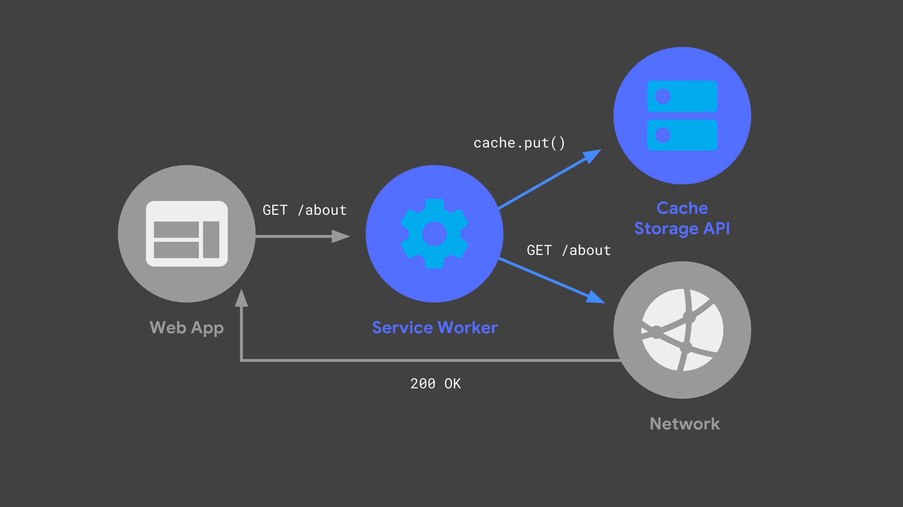
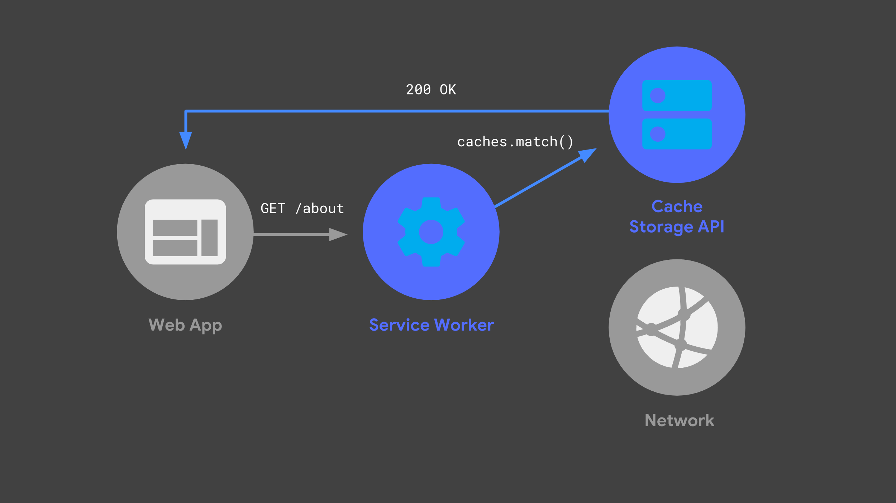

# Service Workers
**Offline ervaring**, **background syncs** en **push notificaties** zijn nu te gebruiken door service workers. Voorheen was dit alleen bruikbaar in **native apps**. 

## Inhoudsopgave
1. [Wat is een service worker?](#wat-is-een-service-worker)
2. [Hoe werkt een service worker?](#hoe-werkt-een-service-worker)
3. [Hoe zet je een service worker op?](#hoe-zet-je-een-service-worker-op)

## 1. Wat is een service worker?
Een service worker draait in de achtergrond en kan functioneren zonder een web pagina of gebruikersinteractie. Een service worker geeft de mogelijkheid tot de volgende features; **push notificatie** en **background sync**. Een service worker wordt nu de dag veel toegepast om een offline ervaring toe te voegen.

Er komen ook wat eisen kijken bij een service worker:
1. Het is alleen toegankelijk via https.
2. Het kan niet rechtsteeks de DOM aanpassen. Dit kan door te communiseren via messages dit verstuur je dan via **postMessage**.
3. Het sluit zichzelf als het niet in gebruik is. Dus afhankelijk zijn van een GLOBAL STATE is niet verstandig en kan leiden tot issues.
4. Het gebruik van **Promises** is vereist. Het is dus verstandig dat dit eerst duidelijk is.

## 2. Hoe werkt een service worker?
Een service worker draait in de achtergrond en kan inkomende connecties filteren of aanpassen. Hieronder wordt een voorbeeld gegeven van een service worker die aan inkomende netwerk connecties is gekoppeld.


De eerst volgende keer dat de web app de zelfde request doet kan deze uit de cache gehaald worden. 


Het opslaan van requests in de cache is dus noodzakelijk om een offline ervaring te kunnen verwezelijken.

## 3. Hoe zet je een service worker op?

Het meest gebruikte voorbeeld van wanneer je een service worker gebruikt is dat je eerst na gaat of dit in de browser ondersteund wordt. Je geeft eigenlijk als het ware
 aan bij de browser waar je service worker te vinden is en vanaf welke scope hij moet werken.

```js
if ('serviceWorker' in navigator) {
  window.addEventListener('load', function() {
    navigator.serviceWorker.register('/sw.js').then(function(registration) {
      console.log('ServiceWorker registration successful with scope: ', registration.scope);
    }, function(err) {
      console.log('ServiceWorker registration failed: ', err);
    });
  });
}
```

### 3.1. Service worker zelf opzetten?
Een service worker schrijf je in javascript. Het is mogelijk om een service worker met ES6 als standaard te schrijven.

```jsx

// Voer code uit zodra een service worker geinstalleerd wordt.
// Dit kan eventueel images ophalen zijn, dit noemen wij ookwel precaching.
self.addEventListener('install', (e) => {

});

// Voer code uit zodra er een fetch naar data gedaan wordt.
// Dit wordt vaak gebruikt om opgehaalde data te cachen of in te laden.
self.addEventListener('fetch', (e) => {

});

// Voer code uit zodra een bestaande serivce worker weer geactiveerd wordt.
// Dit wordt vaak gebruikt om oude cache te verwijderen of te vervangen.
self.addEventListener('activate', (e) => {

});

```

### 3.2. Service worker met Workbox?
Workbox is een javascript library die het gemakkelijker maakt om te werken met een service worker. Er zijn veel mogelijkheden in Workbox die je anders zelf nog moet bouwen. Workbox kan je  [hier](https://developers.google.com/web/tools/workbox/guides/get-started) vinden.
